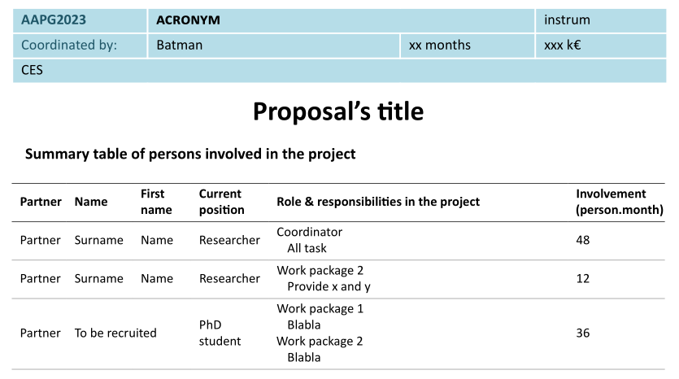

# ANR template

[![CC BY 4.0][cc-by-shield]][cc-by]

This repository store an unofficial template for the ANR.

I am not against the official ANR word template but I see several limitations in it:
* You need word (proprietary and expensive).
* Strongly limited bibliography engine (usually Mendely so same as above x2).
*

## Example

## Previous version

This template is heavily based on the work initiated by Vincent labatut vincent.labatut@univ-avignon.fr.
His template is still maintained and may be found [here](https://www.overleaf.com/latex/templates/unofficial-template-for-anr-proposals/yqgzsxkzrqkw).
Do not hesitate to have a look on his work!

This fork mainly adapted the previous template, made for PDFLaTeX, to the XeTeX engine.
It allows for the use of modern font, here [calibri](https://en.wikipedia.org/wiki/Calibri) and direct utf-8.

## Acknowledgment

This template is heavily based on the work initiated by Vincent labatut vincent.labatut@univ-avignon.fr.

Contributors:
* Nicolas Marchand.
* Christophe Gravier.
* Adel Noureddine.
* Vincent labatut

## License

This work is licensed under a
[Creative Commons Attribution 4.0 International License][cc-by].

[![CC BY 4.0][cc-by-image]][cc-by]

[cc-by]: http://creativecommons.org/licenses/by/4.0/
[cc-by-image]: https://i.creativecommons.org/l/by/4.0/88x31.png
[cc-by-shield]: https://img.shields.io/badge/License-CC%20BY%204.0-lightgrey.svg